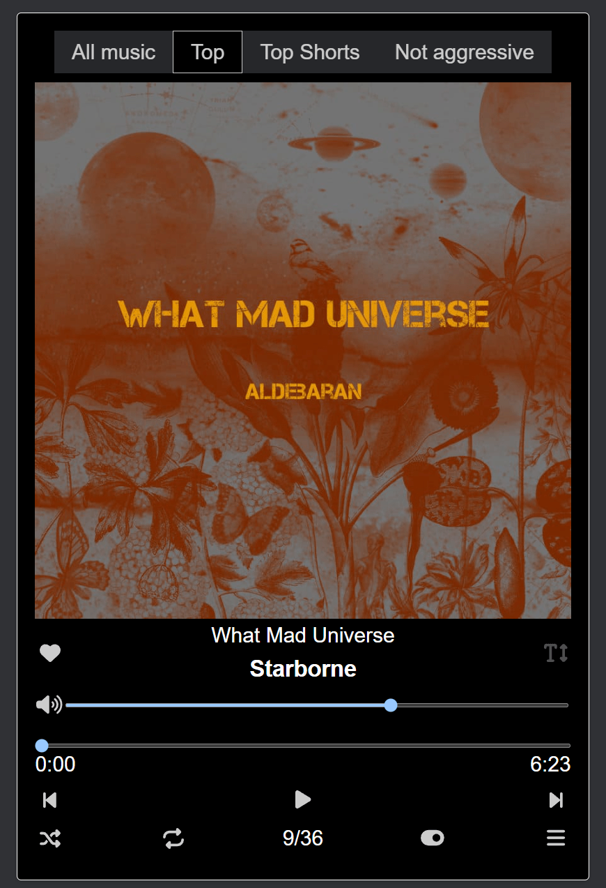

# My Favorite Music Player with Lyrics

### Live Demo: [https://indy660.github.io/player_with_my_favorite_music/](https://indy660.github.io/player_with_my_favorite_music/)

## About

This is a lightweight web-based music player built with Vue 3, Composition API, TypeScript, and Vite. It allows you to play your favorite music and display lyrics (if available) in sync with the song.

## Key Features

*    **Local Music Library:** Plays music files directly from the `/public/music` directory.
*    **Lyrics Support:** Automatically searches for and displays lyrics for each song, if a corresponding lyrics file exists.
*    **Modern Tech Stack:** Built with Vue 3 Composition API, TypeScript, and Vite for optimal performance and developer experience.
*    **Easy Setup:** Simple steps to fork and customize the player with your own music library.
*    **GitHub Pages Deployment:** Automated deployment to GitHub Pages on each push to the `master` branch.

## Getting Started

To use this music player with your own music:

1.  **Fork the project** to your GitHub account.
2.  **Add your music files** (MP3 format) to the `/public/music` folder. Follow the naming convention: `{artist} - {song_name}.mp3` (e.g., `Artist Name - Song Title.mp3`).
3.  **Run the `write_lyric.js` script** to automatically generate the `/src/assets/music_list.json` file and link the lyrics if they exist (or create lyrics files).
  *   If you want third tab of the player that uses AssemblyAI to generate lyrics from audio files before runs script:
  *   create a `.env` file in the root directory of the project and add `ASSEMBLYAI_API_KEY`(e.g., `ASSEMBLYAI_API_KEY=your_api_key_here`).
4.  **If you're deploying to GitHub Pages:**
  *   Go to your repository's **Settings** -> **Environments** -> **New environment**.
  *   Set the environment name to `gh-pages`.
  *   Add a new variable named `VITE_BASE_URL` and set its value to your desired base path (e.g., `/player_with_my_favorite_music/`).
5.  **Push changes** to the `master` branch. This will automatically update your GitHub Pages deployment.
6.  **Enjoy your music!** 🎧

## Development

To contribute or develop locally:

1. Clone the repository.
2. Install dependencies by running `npm install`.
3. Start development server by running `npm run dev`

## Technologies Used

*    **Frontend:** Vue 3 with Composition API, TypeScript
*   **Build Tool:** Vite

## Contributing

Feel free to contribute by forking the repository and submitting a pull request with your changes.
